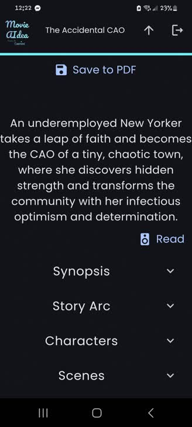
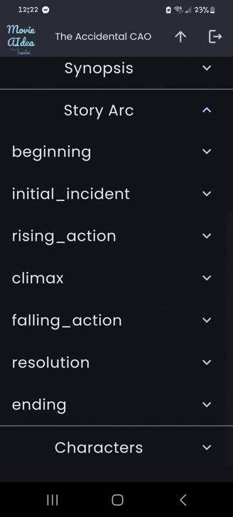
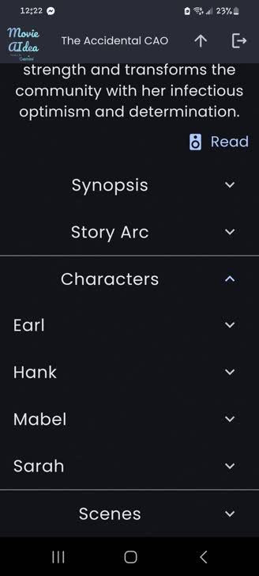
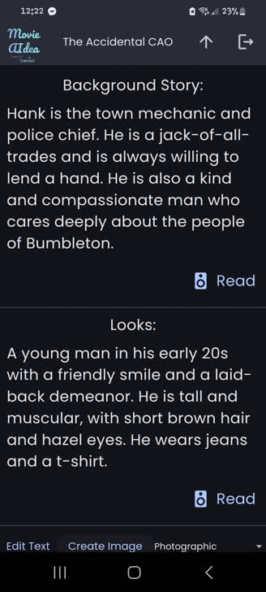
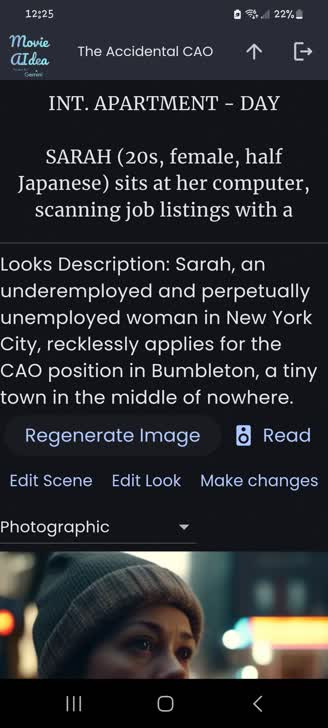
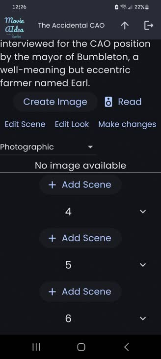
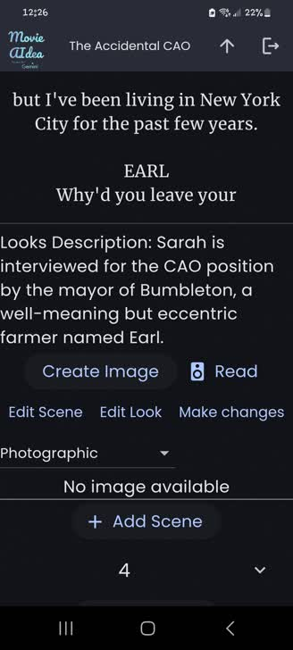

# Movie AIdea

Movie AIdea is a mobile application designed to streamline the scriptwriting process using the Gemini AI API and Stability API. Tailored for writers, it transforms a basic movie idea into a comprehensive script, guiding users through each creative step. Developed with Flutter and supported by Firebase, Movie AIdea provides a seamless experience across Android and iOS platforms.

## Features

- **Idea to Synopsis**: Expand a movie concept into a detailed synopsis.
- **Story Arc Development**: Structure narratives using a 7-stage story arc model.
- **Character Profiles**: Generate detailed character profiles, including traits, backgrounds, and motivations, with image descriptions created by the Stability API.
- **Logline Creation**: Produce a concise, compelling logline to summarize the story.
- **Script Skeleton**: Create an editable script skeleton with the option to add scenes.
- **Cross-Platform Access**: Available on Android and iOS, with data securely stored in Firebase.
- **Export Options**: Export scripts as PDF files for sharing or submission.

## Screenshots

View Screenshots from Movie AIdea:

| | |
|:---:|:---:|
|  |  |
|  |  |
|  |  |
|  |  |

## Getting Started

### Prerequisites

- **Flutter SDK**: Install the Flutter SDK from [flutter.dev](https://flutter.dev/docs/get-started/install).
- **Firebase Account**: Set up a Firebase project at [firebase.google.com](https://firebase.google.com/docs).
- **Gemini API Key**: Obtain a key via the [Google Gemini API](https://developers.google.com/gemini).
- **Stability API Key**: Acquire a key from [Stability AI](https://platform.stability.ai/docs).

### Installation

1. **Clone the Repository** (once uploaded to GitHub):
   ```bash
   git clone https://github.com/nirblu/MovieAIdea.git
   cd MovieAIdea
   ```

2. **Install Dependencies**:
   ```bash
   flutter pub get
   ```

3. **Configure Firebase**:
   - Add `google-services.json` (Android) and `GoogleService-Info.plist` (iOS) to the project.
   - Update Firebase settings to connect to your project.

4. **Add API Keys**:
   - Store Gemini and Stability API keys securely in the app’s configuration.
   - Ensure keys are not exposed in the repository.

5. **Run the App**:
   ```bash
   flutter run
   ```

## Usage

1. **Input Idea**: Enter a movie concept.
2. **Generate Synopsis**: Use Gemini AI to create a detailed synopsis.
3. **Develop Story Arc**: Structure the narrative with the 7-stage model.
4. **Extract Characters**: Generate profiles with Stability AI image descriptions.
5. **Create Logline**: Produce a compelling logline.
6. **Build Script**: Edit and expand the AI-generated script skeleton.
7. **Export**: Save the script as a PDF.

## Handling Errors

- **Resolve Issues**: Navigate back and reopen the script to fix most errors.
- **Check Connectivity**: Ensure a stable internet connection for Firebase, Gemini, and Stability APIs.
- **Debug**: Check console logs and verify API configurations.

## Important Notice

Movie AIdea was developed for the Google Gemini API Developer Competition. The source code is shared under the MIT License, but users should respect the competition context and provide proper attribution.

## License

This project is licensed under the MIT License. See the [LICENSE](LICENSE) file for details.

Copyright © 2025 Nir Blootrich

## Acknowledgments

- Google Gemini API for AI-driven scriptwriting.
- Stability AI for character image descriptions.
- Flutter for cross-platform development.
- Firebase for secure data storage.

